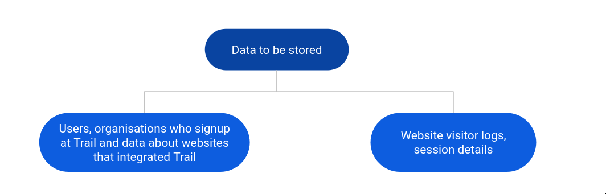
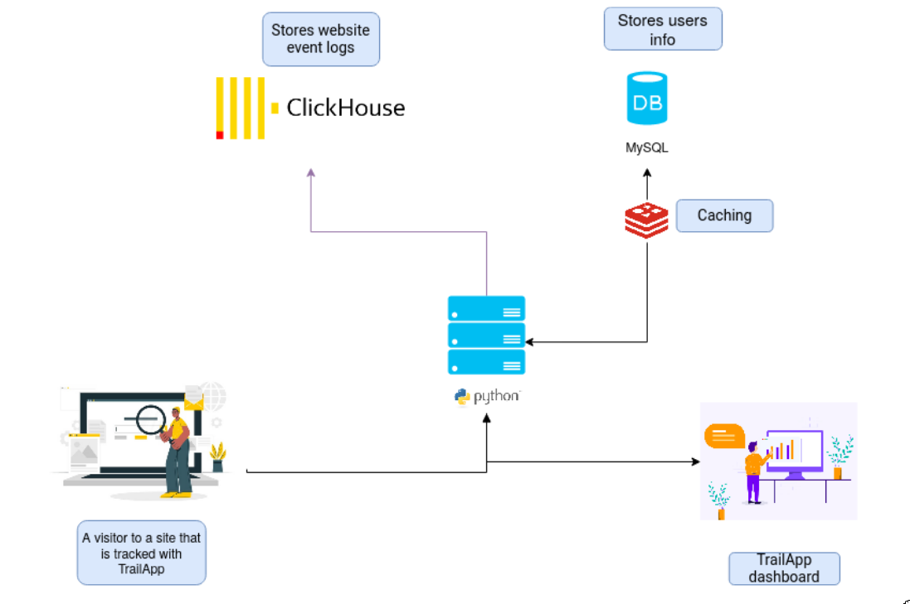

# TrailApp

### The what
(_What is this project about?_)

Trail is an open-source user analytics and event tracking platform for your sites. 
With Trail, you can get insights to into the userbase of your site - info on the content people like, some info on the demographics of the users etc etc.
We would say that this is a minimal version of Google Analytics, minus the aggressive tracking.

### The how
(_Instructions to run locally_)

 1. Clone the repo
 2. Run the MySQl, ClickHouse and Redis 
    If you use docker, then do `$ docker-compose up`
 3. Install the dependencies and run
 ```
 $ virtualenv trail-venv --python=python3
 $ source trail-venv/bin/activate
 $ pip install -r requirements.txt
 $ flask run
 ```

 You can configure ports and authentication in `config.py`, or by setting them in the enviroment or `.flaskenv`


### The stack
(_What did you use to build this?_)
The current version is built using [Flask](https://flask.palletsprojects.com/en/1.1.x/) and uses MySQL and ClickHouse for database.
Redis is used for caching.

### The internals
(_Some thoughts on the development and working_)

**Why ClickHouse?**
Trail was originally written completely with MySQL and then later migrated to ClickHouse.

Before looking into the database chosen, consider the nature of the data to be stored by the application



Of these, the second one is almost entirely immutable data - once entered, it cannot change, but we'll constantly be doing queries on it.

ClickHouse is a DBMS system specifically optimised and designed for exactly these type of data -  immutable, but requires frequent analysis. It is an OLAP system as opposed to OLTP system (like MySQL)

So, since ClickHouse is great for analytics (and it was something new to learn), ClickHouse is used for the logs and the others are retained in MySQL


**How everything fits together?**


The diagram above depicts the flow of the program.

Once a user is setup and has configured their site with Trail, the site starts generating logs
and it will be updated in realtime in the dashboard.

The overall flow is relatively simple.
Whenever a visitor visits the site setup with Trail, 
it sends a events through the API, which is processed and validated by the Flask server and logs the entry into ClickHouse.

The site data gets updated in realtime with the help of
Clickhouse's fast on-the-fly reporting capabilities


### The why
(_Why did we work on this project?_)

For fun and to learn!
(and we had to submit a project for school :sweat_smile:)

### Demo

You can checkout the demo hosted here

### TODOs

- [ ] Re-organise the code and improve the overall structure
- [ ] Abstract the database interactions - maybe consider using an ORM
- [ ] Document better

### Credits

- Thanks to the [Argon](https://github.com/creativetimofficial/argon-dashboard) project, based on which the frontend is built.

### Hosting

If you are considering using Trail for a production application, and need help in setting up/self-hosting it, please feel free to reach out.
We would  be more than happy to help!

### Contributing

Contributions are always welcome, it would be great to have you contributing to this project.
Please feel free to open an issue if you have something in mind.

